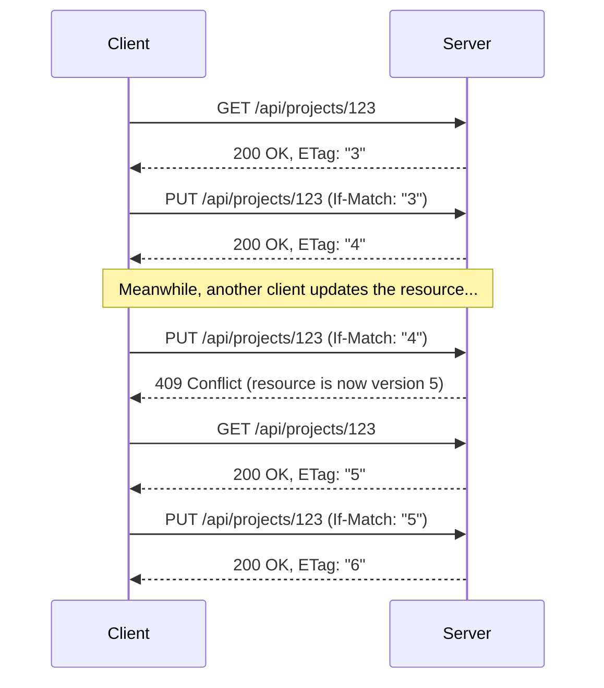

# REST API Overview

The GroundControl management API follows REST conventions. This page covers the patterns you will use across all endpoints.

## Base URL and versioning

All management endpoints are under `/api/`. Client endpoints are under `/client/`. Auth endpoints are under `/auth/`.

Include the `api-version` header with every request. The current version is `1.0`.

```bash
curl http://localhost:8080/api/scopes \
  -H "api-version: 1.0"
```

If you omit the header, the server defaults to version `1.0`. The response includes `api-supported-versions` and `api-deprecated-versions` headers.

## Request and response format

- Content type: `application/json`
- All request bodies are JSON
- All responses are JSON (except SSE streams)

## Authentication

Depending on the server's auth mode:

| Mode | Management API | Client API |
|---|---|---|
| None | No auth required | No auth required |
| BuiltIn | Cookie or `Authorization: Bearer <jwt/pat>` | `Authorization: ApiKey <clientId>:<clientSecret>` |
| External | Cookie or `Authorization: Bearer <pat>` | `Authorization: ApiKey <clientId>:<clientSecret>` |

The Client API (`/client/*`) always uses ApiKey authentication, regardless of auth mode. See [Authentication](../server/authentication.md).

## Pagination

List endpoints return paginated results using cursor-based pagination.

**Query parameters:**

| Parameter | Default | Description |
|---|---|---|
| `limit` | `25` | Items per page (1--100). |
| `after` | _(none)_ | Cursor for the next page. |
| `before` | _(none)_ | Cursor for the previous page. |
| `sortField` | varies | Field to sort by. |
| `sortOrder` | `asc` | Sort direction: `asc` or `desc`. |

**Response envelope:**

```json
{
  "data": [ ... ],
  "nextCursor": "eyJpZCI6IjAxOTJkNGUw...",
  "previousCursor": null,
  "totalCount": 42
}
```

To page forward, pass `nextCursor` as the `after` parameter. To page backward, pass `previousCursor` as `before`.

> **Note:** Cursors are opaque strings. They are only valid with the same filters and sort order used to generate them.

## Optimistic concurrency with ETags

GroundControl uses ETags to prevent conflicting updates. This is the flow:

1. **Read** a resource -- the response includes an `ETag` header:

```
HTTP/1.1 200 OK
ETag: "3"
Content-Type: application/json

{ "id": "...", "name": "My Project", "version": 3, ... }
```

2. **Update or delete** the resource -- include the ETag value in an `If-Match` header:

```bash
curl -X PUT http://localhost:8080/api/projects/PROJECT_ID \
  -H "Content-Type: application/json" \
  -H "api-version: 1.0" \
  -H 'If-Match: "3"' \
  -d '{"name": "Renamed Project"}'
```

3. **Possible outcomes:**

| Status | Meaning |
|---|---|
| `200 OK` | Update succeeded. The response includes the new ETag. |
| `409 Conflict` | Someone else modified the resource since you read it. Re-read and retry. |
| `428 Precondition Required` | You forgot the `If-Match` header. |



## Error responses

Errors follow the RFC 9457 Problem Details format:

```json
{
  "type": "https://tools.ietf.org/html/rfc9110#section-15.5.1",
  "title": "Bad Request",
  "status": 400,
  "detail": "The 'dimension' field is required.",
  "errors": {
    "dimension": ["The 'dimension' field is required."]
  }
}
```

**Common status codes:**

| Status | Meaning |
|---|---|
| `400 Bad Request` | Validation failed (missing fields, invalid values). |
| `401 Unauthorized` | Missing or invalid credentials. |
| `403 Forbidden` | You don't have permission for this action. |
| `404 Not Found` | Resource doesn't exist. |
| `409 Conflict` | Version conflict (ETag mismatch), duplicate resource, or resource has dependents and can't be deleted. |
| `422 Unprocessable Content` | Semantically invalid (e.g., publishing a snapshot with unresolved variables). |
| `428 Precondition Required` | Missing `If-Match` header on update/delete. |

## Sensitive values

Configuration entries and variables can be marked as sensitive. By default, their values are masked in API responses:

```json
{
  "key": "Database:Password",
  "values": [
    { "value": "***" }
  ]
}
```

To retrieve the actual value, add `?decrypt=true` to the request. This requires the `sensitive_values:decrypt` permission.

```bash
curl http://localhost:8080/api/config-entries/ENTRY_ID?decrypt=true \
  -H "api-version: 1.0"
```

## What's next?

- [Endpoints Reference](endpoints.md) -- all endpoints with request/response examples
- [CLI Reference](../../cli/README.md) -- manage configuration from the command line
