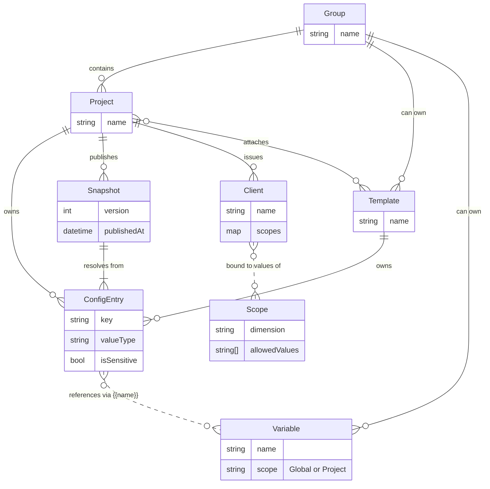

# Core Concepts

GroundControl organizes configuration around a few key concepts. Understanding how they fit together will help you set up and manage configuration effectively.

## Scopes

A scope is a dimension your configuration varies by. Common examples include Environment (dev, staging, prod), Region (us-east, eu-west), and AppTier (frontend, backend) -- but you can define any dimension that makes sense for your organization.

Each scope has a set of allowed values. When you need configuration that differs per environment, per region, or along any other axis, define a scope for that axis and assign it the valid values.

### Scope resolution

When a client requests configuration, GroundControl picks the most specific matching value. Consider an entry with values for three scope combinations:

- `{}` (default) -- "Info"
- `{Environment: prod}` -- "Warning"
- `{Environment: prod, Region: eu}` -- "Error"

A client bound to `{Environment: prod, Region: eu}` receives "Error" because that combination matches the most dimensions. A client bound to `{Environment: prod, Region: us}` receives "Warning" because only the Environment dimension matches. If no scoped value matches at all, the default value is used.

## Groups

Groups are organizational containers for projects, templates, and variables. Use groups to model teams, departments, or business units -- any boundary that reflects how your organization owns and manages configuration.

Groups also provide a boundary for access control. You can grant users permissions scoped to a specific group, so that team members manage only the configuration they are responsible for.

## Projects

A project represents one application or service that consumes configuration. Each project belongs to a group.

Projects own their configuration entries and can inherit shared entries from templates. Each project can also have multiple clients (API keys) for different scope combinations, so a single project can serve configuration to the same application running in different environments or regions.

## Templates

Templates are reusable sets of configuration entries shared across projects. Use templates for cross-cutting configuration that many projects need -- logging defaults, feature flags, common database settings, and similar concerns.

A project can attach multiple templates. If a project defines an entry with the same key as a template entry, the project's value takes precedence.

Templates can be global (available to all projects) or group-scoped (available only to projects within that group).

## Variables

Variables are named placeholders you reference in configuration values using `{{variableName}}` syntax. Like configuration entries, variables have scope-aware values -- a variable can resolve to different values depending on the client's scope combination.

Variables come in two tiers:

- **Global variables** are shared across all projects.
- **Project-level variables** override a global variable's value for a specific project.

Use variables for values that appear in many entries, such as a connection string prefix, an API endpoint, or a shared secret. This lets you change the value in one place instead of updating every entry that uses it.

Variables are resolved at publish time. If a configuration value references a variable that is undefined or cannot be resolved for the target scope, the publish fails with an error telling you exactly which variable is missing.

## Configuration Entries

Configuration entries are the individual key-value pairs that make up your configuration. Each entry has:

- A **key** (e.g., `App:LogLevel`, `Database:ConnectionString`)
- A **value type** (String, Int32, Boolean, and others)
- One or more **scoped values**

An entry can have a default value (no scope) plus values for specific scope combinations. For example, an entry with key `App:LogLevel` might have a default value of "Information" and a scoped value of "Warning" for `{Environment: prod}`.

Entries can be owned by a project or by a template. When a template entry and a project entry share the same key, the project entry wins.

An entry can be marked as **sensitive**. Sensitive values are encrypted at rest and masked in API responses unless you explicitly request decryption. Use this for secrets, connection strings, and other values that should not be casually visible.

## Snapshots

A snapshot is an immutable, point-in-time capture of a project's fully resolved configuration. You create a snapshot by performing a "publish" action, which:

1. Merges template entries with project entries (project entries take precedence)
2. Interpolates all variable references
3. Encrypts sensitive values
4. Stores the result as a new, versioned snapshot

Clients always receive configuration from the **active** snapshot. Snapshots are versioned sequentially (1, 2, 3, ...) and cannot be modified after creation.

If you need to revert a configuration change, activate a previous snapshot. The old snapshot becomes the active one and all clients immediately receive that version's configuration.

## Clients

A client is an API key (client ID and client secret) that your application uses to authenticate with GroundControl and retrieve its configuration.

Each client is tied to:

- A **project** -- determining which configuration entries are available
- A **scope combination** -- determining which scoped values are returned (e.g., `{Environment: dev, Region: us-east}`)

You can create multiple clients for the same project and scope combination to support key rotation. When you create a client, the client secret is shown only once -- store it securely.

Clients can also accept extra scope dimensions supplied by the SDK at request time (see [SDK Options Reference](sdk/options-reference.md)); server-defined scopes on the Client entity win on key conflict.

## Entity Relationships

The following diagram shows how the core concepts relate to each other:

## How It All Fits Together

A typical workflow for setting up configuration in GroundControl follows these steps:

1. **Create scopes** for the dimensions your configuration varies by (e.g., Environment with values dev, staging, prod).
2. **Create a group** to organize your team's projects and shared resources.
3. **Create templates** with shared configuration entries that multiple projects will need (e.g., a "Logging" template, a "Feature Flags" template).
4. **Create a project** within the group and attach the relevant templates.
5. **Add project-specific entries** for configuration that is unique to this application.
6. **Define variables** for values that are referenced across many entries, such as shared connection strings or API endpoints.
7. **Publish a snapshot** to resolve all entries, interpolate variables, and produce an immutable configuration version.
8. **Create clients** for each environment or scope combination your application runs in, and configure your application with the client credentials.

Once your application starts with a client's credentials, it authenticates with GroundControl and receives the active snapshot's configuration, fully resolved for the client's scope combination.

For a hands-on walkthrough of these steps, see [Getting Started](getting-started.md).
