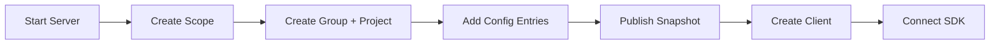

# Getting Started

This guide walks you through setting up a GroundControl server, creating your first configuration, and connecting a .NET application. The entire process takes under 10 minutes.



## Prerequisites

- [.NET 10 SDK](https://dotnet.microsoft.com/download)
- [Aspire CLI](https://learn.microsoft.com/dotnet/aspire/dotnet-aspire-cli)
- [Docker](https://docs.docker.com/get-docker/) (used by Aspire to run MongoDB)

## Step 1: Start the server

Clone the repository and launch the Aspire AppHost. Aspire orchestrates a standalone MongoDB container alongside the API and opens a dashboard with the URLs of every resource.

```bash
git clone https://github.com/<your-fork>/GroundControl.git
cd GroundControl
aspire start src/GroundControl.AppHost
```

The Aspire dashboard opens in your browser. Find the `api` resource — note the HTTP URL it is bound to. The rest of this guide uses `http://localhost:8080` as a placeholder; substitute the URL from the dashboard.

Verify the API is ready:

```bash
curl http://localhost:8080/healthz/ready
```

You should receive an HTTP 200 response once the server is ready.

> **Note:** The AppHost starts the API with authentication set to `None`, which means all requests run as a built-in admin. See [Authentication](server/authentication.md) for production setup.

## Step 2: Create a scope

A scope defines a dimension that your configuration varies by, such as environment, region, or tenant. Create an "Environment" scope with three allowed values:

```bash
curl -X POST http://localhost:8080/api/scopes \
  -H "Content-Type: application/json" \
  -H "api-version: 1.0" \
  -d '{
    "dimension": "Environment",
    "allowedValues": ["dev", "staging", "prod"],
    "description": "Deployment environment"
  }'
```

Note the `id` in the response -- you will need it later.

## Step 3: Create a group and project

Groups organize related projects. Create a group, then create a project within it:

```bash
# Create a group
curl -X POST http://localhost:8080/api/groups \
  -H "Content-Type: application/json" \
  -H "api-version: 1.0" \
  -d '{"name": "Platform Team", "description": "Platform engineering"}'

# Create a project (use the group ID from above)
curl -X POST http://localhost:8080/api/projects \
  -H "Content-Type: application/json" \
  -H "api-version: 1.0" \
  -d '{"name": "My Web App", "description": "Customer-facing web application", "groupId": "GROUP_ID_HERE"}'
```

Replace `GROUP_ID_HERE` with the `id` returned from the group creation response.

## Step 4: Add a configuration entry

Create a configuration entry with a default value and environment-specific overrides:

```bash
# Use the project ID from above as ownerId
curl -X POST http://localhost:8080/api/config-entries \
  -H "Content-Type: application/json" \
  -H "api-version: 1.0" \
  -d '{
    "key": "App:LogLevel",
    "valueType": "String",
    "ownerId": "PROJECT_ID_HERE",
    "ownerType": "Project",
    "description": "Application log level",
    "values": [
      {"value": "Information"},
      {"scopes": {"Environment": "dev"}, "value": "Debug"},
      {"scopes": {"Environment": "prod"}, "value": "Warning"}
    ]
  }'
```

The first value (with no scopes) is the default. The scoped values override it when a client matches that specific environment. In this example, `dev` clients receive `Debug`, `prod` clients receive `Warning`, and everything else falls back to `Information`.

## Step 5: Publish a snapshot

Publishing resolves all configuration entries, interpolates any variables, and produces an immutable snapshot. Clients always receive configuration from the active snapshot.

```bash
curl -X POST http://localhost:8080/api/projects/PROJECT_ID_HERE/snapshots \
  -H "Content-Type: application/json" \
  -H "api-version: 1.0" \
  -d '{"description": "Initial configuration"}'
```

Replace `PROJECT_ID_HERE` with your project ID.

## Step 6: Create a client

A client represents a specific application instance with fixed scope values. The server resolves the correct configuration for each client based on its scopes.

```bash
curl -X POST http://localhost:8080/api/projects/PROJECT_ID_HERE/clients \
  -H "Content-Type: application/json" \
  -H "api-version: 1.0" \
  -d '{
    "name": "my-web-app-dev",
    "scopes": {"Environment": "dev"}
  }'
```

The response includes a `clientId` and `clientSecret`. Save both values -- the secret is only shown once. This client will receive configuration resolved for the `dev` environment.

## Step 7: Connect your .NET app

Create a new web application and install the GroundControl client SDK:

```bash
dotnet new web -n MyWebApp
cd MyWebApp
dotnet add package GroundControl.Link
```

Replace the contents of `Program.cs` with:

```csharp
var builder = WebApplication.CreateBuilder(args);

builder.Configuration.AddGroundControl(options =>
{
    options.ServerUrl = "http://localhost:8080";
    options.ClientId = "CLIENT_ID_HERE";
    options.ClientSecret = "CLIENT_SECRET_HERE";
});

var app = builder.Build();

app.MapGet("/", (IConfiguration config) =>
    new { LogLevel = config["App:LogLevel"] });

app.Run();
```

Replace `CLIENT_ID_HERE` and `CLIENT_SECRET_HERE` with the values from Step 6.

Run the application and verify the configuration is loaded:

```bash
dotnet run
```

Visit the root endpoint. You should see:

```json
{"logLevel": "Debug"}
```

The value is `Debug` because the client was created with `Environment: dev`, and the scoped value for `dev` overrides the default.

## What's next?

- [Concepts](concepts.md) -- understand the full domain model
- [SDK Quickstart](sdk/quickstart.md) -- deeper SDK integration guide
- [Server Deployment](server/deployment.md) -- production deployment
- [CLI Reference](../cli/README.md) -- manage configuration from the command line
