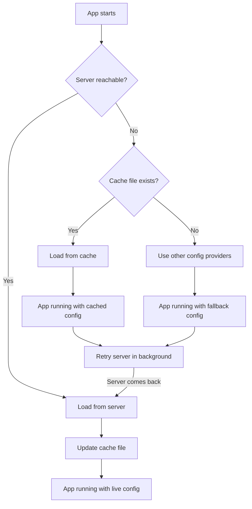

# Caching and Offline Resilience

The SDK can persist configuration to a local file so your application starts even when the server is unreachable.

## Enabling the cache

The cache is enabled by default. Customize the file path if needed:

```csharp
builder.Configuration.AddGroundControl(options =>
{
    // ...
    options.EnableLocalCache = true; // default
    options.CacheFilePath = "/var/cache/myapp/groundcontrol.json";
});
```

To disable caching:

```csharp
options.EnableLocalCache = false;
```

## How the cache works

- Every time the SDK receives a configuration update (via SSE or polling), it writes the data to the cache file.
- Writes are atomic (the SDK writes to a temporary file first, then renames it) to prevent corruption.
- The cache file is a JSON file containing the configuration key-value pairs.

## Fallback chain on startup

When your application starts, the SDK tries to load configuration in this order:

1. **Server** -- Connect to the GroundControl server (within `StartupTimeout`, default 10 seconds).
2. **Local cache** -- If the server is unreachable, load from the cache file.
3. **Other configuration providers** -- If no cache exists, the application falls back to whatever other providers are registered (for example, `appsettings.json`).

After falling back to the cache, the SDK continues trying to reach the server in the background. Once the server becomes available, configuration is updated automatically.



## Cache file security

By default the cache file is written in plaintext. To encrypt sensitive values at rest, implement `IConfigurationProtector` and assign it to `options.Protector`:

```csharp
builder.Configuration.AddGroundControl(options =>
{
    // ...
    options.Protector = new MyProtector(); // your IConfigurationProtector implementation
});
```

- Only entries the server has marked as sensitive go through the protector; non-sensitive entries (feature flags, URLs, thresholds) stay plaintext and remain readable for diagnostics.
- If the protector is not configured, every entry is cached plaintext — an explicit opt-out.
- The SDK treats ciphertext as opaque; key rotation and algorithm versioning are your protector's responsibility.
- If `Unprotect` throws, or if the cache was written under a different protector configuration than the one in effect now, the file is treated as a cache miss and the next save overwrites it.
- Cache portability depends entirely on your protector (e.g., DPAPI keys are per-machine; an AES implementation with a shared key is portable).

> **Warning:** Ensure the cache file directory has appropriate file system permissions. The file contains your application's configuration.

## When to disable caching

- Short-lived batch jobs that always have server connectivity.
- Environments where writing to the local file system is not permitted.
- When you do not want any configuration persisted outside the server.

## What's next?

- [Connection Modes](connection-modes.md) -- choose how the SDK connects
- [Options Reference](options-reference.md) -- all cache-related options
