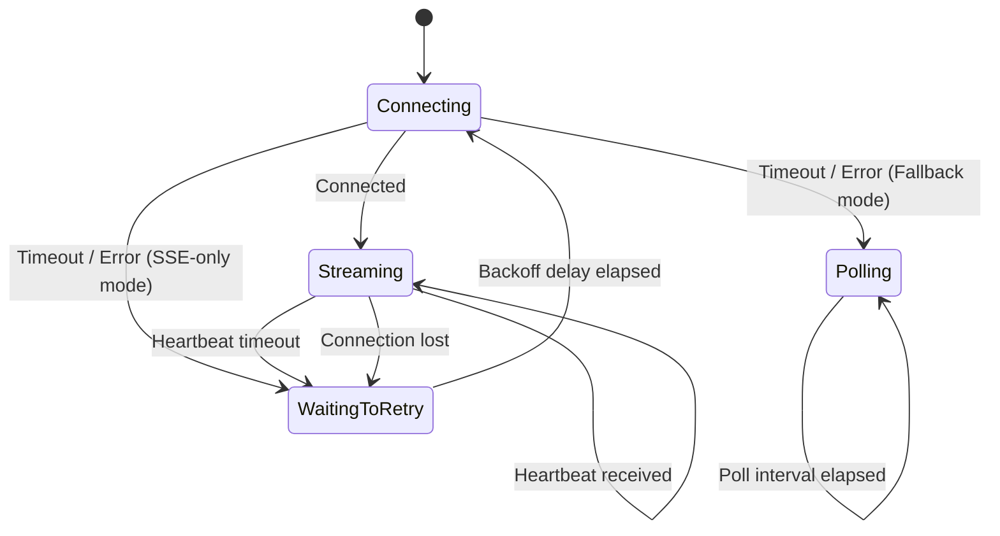

# Connection Modes

The SDK supports three ways to receive configuration updates from the server. Choose the mode that fits your infrastructure.

## SSE with Polling Fallback (default)

This mode attempts a Server-Sent Events connection first for real-time updates. If SSE fails or times out during startup, the SDK automatically falls back to periodic REST polling. If an established SSE connection drops later, the SDK switches to polling rather than leaving your application without updates.

**Best for:** Most deployments. You get real-time updates when possible, with automatic resilience when SSE is unavailable.

## SSE Only

This mode uses Server-Sent Events exclusively. On disconnect, the SDK retries with exponential backoff (starting at `SseReconnectDelay`, capped at `SseMaxReconnectDelay`). There is no polling fallback -- if SSE is not available, the SDK relies on the last known configuration in memory or from the local cache.

**Best for:** Low-latency environments where you need instant updates and SSE connectivity is guaranteed.

## Polling Only

This mode fetches configuration via periodic REST calls at the `PollingInterval` (default: 5 minutes). The SDK uses conditional requests with ETags to avoid re-downloading unchanged data. No SSE connection is opened.

**Best for:** Environments behind proxies or firewalls that block SSE or other long-lived connections.

## Choosing a mode

| Your situation | Recommended mode |
|---|---|
| Standard deployment, want real-time updates | `SseWithPollingFallback` (default) |
| Guaranteed SSE support, lowest latency needed | `Sse` |
| Corporate proxy blocks SSE / long-lived connections | `Polling` |
| Batch jobs that run briefly | `Polling` |

## Setting the mode

```csharp
builder.Configuration.AddGroundControl(options =>
{
    options.ServerUrl = "https://groundcontrol.example.com";
    options.ClientId = "your-client-id";
    options.ClientSecret = "your-client-secret";
    options.ConnectionMode = ConnectionMode.Sse;
});
```

## How SSE connections work

The SSE lifecycle follows these steps:

1. The SDK opens an SSE connection to the server.
2. The server sends the current configuration immediately.
3. The server sends heartbeat events periodically to detect dead connections.
4. When a new snapshot is activated, the server pushes the updated configuration.
5. If no data arrives within `SseHeartbeatTimeout` (default: 2 minutes), the connection is considered lost.
6. The SDK reconnects with exponential backoff: starts at `SseReconnectDelay` (5 seconds), doubles each attempt, and caps at `SseMaxReconnectDelay` (5 minutes).



## What happens on failure

- **SSE with Polling Fallback:** Falls back to polling. Your application continues receiving updates, just with a delay equal to the polling interval.
- **SSE Only:** Retries SSE with exponential backoff. Between retries, the application uses the last known configuration in memory or from the local cache.
- **Polling:** Retries at the next poll interval. Failed polls are logged but do not interrupt the application.

In all modes, the local file cache (if enabled) provides a safety net. See [Caching](caching.md) for details.

Refer to [Options Reference](options-reference.md) for all timing-related properties.
