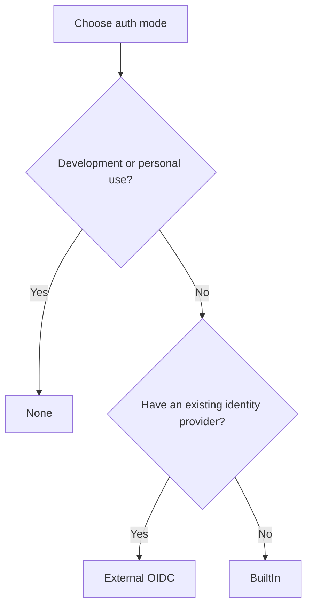

# Authentication

GroundControl supports three authentication modes. Choose the one that fits your environment.



## None (development)

All requests are treated as a system admin — no login required. No auth endpoints are exposed. This mode is suitable for local development and personal homelab use.

```json
{
  "Authentication": {
    "Mode": "None"
  }
}
```

> **Warning:** Never use `None` mode in production. Every API call has full admin access with no identity tracking.

## BuiltIn (self-contained)

BuiltIn mode manages users, passwords, and roles entirely within GroundControl using ASP.NET Identity with MongoDB. It supports cookie-based authentication for browser UIs and JWT bearer tokens for API clients, including refresh token rotation for JWT sessions.

### Setting up BuiltIn auth

1. Generate a JWT signing secret (must be at least 256 bits / 32 bytes, base64-encoded):

```bash
openssl rand -base64 32
```

2. Configure the server:

```json
{
  "Authentication": {
    "Mode": "BuiltIn",
    "BuiltIn": {
      "Jwt": {
        "Secret": "YOUR_BASE64_SECRET_HERE",
        "Issuer": "GroundControl",
        "Audience": "GroundControl",
        "AccessTokenLifetime": "01:00:00",
        "RefreshTokenLifetime": "7.00:00:00"
      }
    },
    "Seed": {
      "AdminPassword": "YourSecurePassword123!"
    }
  }
}
```

3. Start the server. An admin account is created automatically with:
   - Username: `admin` (configurable via `Authentication:Seed:AdminUsername`)
   - Email: `admin@local` (configurable via `Authentication:Seed:AdminEmail`)
   - Password: the value of `Authentication:Seed:AdminPassword`
   - Full system admin permissions

> **Note:** The admin seed is idempotent — restarting the server won't duplicate the account. If you change the password in the seed config, it updates the existing admin's password.

### JWT settings

| Setting | Default | Description |
|---|---|---|
| `Authentication:BuiltIn:Jwt:Secret` | _(required)_ | Base64-encoded signing key (min 256 bits). |
| `Authentication:BuiltIn:Jwt:Issuer` | `GroundControl` | Token issuer claim. |
| `Authentication:BuiltIn:Jwt:Audience` | `GroundControl` | Token audience claim. |
| `Authentication:BuiltIn:Jwt:AccessTokenLifetime` | `1 hour` | How long access tokens are valid. |
| `Authentication:BuiltIn:Jwt:RefreshTokenLifetime` | `7 days` | How long refresh tokens are valid. |

### Cookie settings

| Setting | Default | Description |
|---|---|---|
| `Authentication:BuiltIn:Cookie:Name` | `.GroundControl.Auth` | Name of the authentication cookie. |
| `Authentication:BuiltIn:Cookie:ExpireTimeSpan` | `14 days` | Cookie lifetime. |
| `Authentication:BuiltIn:Cookie:SlidingExpiration` | `true` | Renew the cookie on each request if past the halfway point. |

### Password policy

| Setting | Default | Description |
|---|---|---|
| `Authentication:BuiltIn:Password:RequiredLength` | `12` | Minimum password length. |
| `Authentication:BuiltIn:Password:RequireDigit` | `true` | Require at least one digit. |
| `Authentication:BuiltIn:Password:RequireUppercase` | `true` | Require at least one uppercase letter. |
| `Authentication:BuiltIn:Password:RequireLowercase` | `true` | Require at least one lowercase letter. |
| `Authentication:BuiltIn:Password:RequireNonAlphanumeric` | `false` | Require at least one special character. |

### Lockout policy

| Setting | Default | Description |
|---|---|---|
| `Authentication:BuiltIn:Lockout:MaxFailedAttempts` | `5` | Failed login attempts before lockout. |
| `Authentication:BuiltIn:Lockout:LockoutDuration` | `15 minutes` | How long the account stays locked. |

### Auth endpoints (BuiltIn mode)

| Method | Path | Description |
|---|---|---|
| `POST` | `/auth/login` | Log in with username + password (sets a cookie). |
| `POST` | `/auth/logout` | Clear the session cookie. |
| `POST` | `/auth/token` | Get a JWT access token + refresh token. |
| `POST` | `/auth/token/refresh` | Exchange a refresh token for a new access + refresh token pair. |
| `GET` | `/auth/me` | Get the current user's profile. |

## External OIDC (enterprise SSO)

External mode delegates authentication to an external identity provider such as Entra ID, Keycloak, or Okta. GroundControl handles the OIDC redirect flow and issues its own session cookie. Users are provisioned automatically on first login (JIT provisioning).

### Setting up External auth

```json
{
  "Authentication": {
    "Mode": "External",
    "External": {
      "Authority": "https://login.microsoftonline.com/YOUR_TENANT_ID/v2.0",
      "ClientId": "your-oidc-client-id",
      "ClientSecret": "your-oidc-client-secret",
      "Scopes": ["openid", "profile", "email"],
      "CallbackPath": "/signin-oidc",
      "ProviderName": "entra",
      "JitProvisioning": {
        "Enabled": true,
        "MatchByEmail": true,
        "AutoCreate": true
      }
    }
  }
}
```

### External OIDC settings

| Setting | Default | Description |
|---|---|---|
| `Authentication:External:Authority` | _(required)_ | OIDC authority URL (issuer). |
| `Authentication:External:ClientId` | _(required)_ | OIDC client/application ID. |
| `Authentication:External:ClientSecret` | _(none)_ | OIDC client secret (if required by provider). |
| `Authentication:External:ResponseType` | `code` | OIDC response type. |
| `Authentication:External:Scopes` | `openid, profile, email` | OIDC scopes to request. |
| `Authentication:External:CallbackPath` | `/signin-oidc` | Path for the OIDC callback. Must match the redirect URI configured in your identity provider. |
| `Authentication:External:Audience` | _(none)_ | Expected audience claim (if your provider requires it). |
| `Authentication:External:ProviderName` | `oidc` | Display name for the provider. |

### JIT provisioning

When a user logs in through the external provider for the first time, GroundControl creates a local user record.

| Setting | Default | Description |
|---|---|---|
| `Authentication:External:JitProvisioning:Enabled` | `true` | Enable automatic user provisioning. |
| `Authentication:External:JitProvisioning:MatchByEmail` | `true` | Match existing users by email address (useful when migrating from BuiltIn to External). |
| `Authentication:External:JitProvisioning:AutoCreate` | `true` | Create a new user if no match is found. If `false`, unmatched users are rejected. |

> **Note:** Auto-created users have no permissions by default. An admin must assign roles after the user's first login.

### Cookie settings (External)

| Setting | Default | Description |
|---|---|---|
| `Authentication:External:Cookie:Name` | `.GroundControl.Auth` | Session cookie name. |
| `Authentication:External:Cookie:ExpireTimeSpan` | `14 days` | Session lifetime. |
| `Authentication:External:Cookie:SlidingExpiration` | `true` | Renew session on activity. |

### Auth endpoints (External mode)

| Method | Path | Description |
|---|---|---|
| `GET` | `/auth/login/external` | Redirect to the identity provider's login page. |
| `GET` | `/auth/callback` | OIDC callback (handled automatically). |
| `GET` | `/auth/me` | Get the current user's profile. |

## CSRF protection

When using cookie-based authentication (BuiltIn or External modes), CSRF protection is enabled by default using a double-submit cookie pattern.

| Setting | Default | Description |
|---|---|---|
| `Authentication:Csrf:Enabled` | `true` | Enable CSRF protection. |
| `Authentication:Csrf:CookieName` | `XSRF-TOKEN` | Name of the CSRF cookie. |
| `Authentication:Csrf:HeaderName` | `X-XSRF-TOKEN` | Header name the client must send. |

Your SPA or client reads the `XSRF-TOKEN` cookie value and sends it back in the `X-XSRF-TOKEN` header with each mutating request (POST, PUT, DELETE).

## Personal access tokens

Available in BuiltIn and External modes. PATs provide long-lived authentication for scripts, CI/CD pipelines, and programmatic access.

- Create PATs via `POST /api/personal-access-tokens`
- Tokens use the format `gc_pat_...` and the full value is shown only once at creation
- You can optionally scope a PAT's permissions to a subset of your own permissions
- Default expiry: 90 days (configurable, max 365 days)
- Send PATs in the `Authorization: Bearer gc_pat_...` header

See the [CLI authentication docs](../../cli/authentication.md) for managing PATs from the command line.

## What's next?

- [Configuration](configuration.md) — all server settings
- [Deployment](deployment.md) — deployment patterns and scaling
